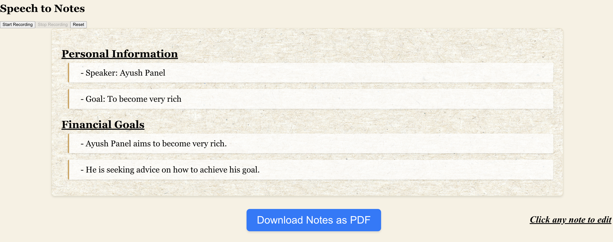

# 📝 Note-Taking Tool

Welcome to my AI-powered Note-Taking Tool! This project captures real-time audio input, transcribes it, organizes the transcription into categorized notes, and makes them easily accessible for download. Designed with React and Node.js, this tool leverages the OpenAI API to create structured and concise notes from audio recordings.

---

## 📸 Interface Preview



---

## 🚀 Project Overview

The Note-Taking Tool is designed to help users focus on discussions or lectures without worrying about manual note-taking. It transcribes speech in real-time and organizes the content into relevant categories, allowing users to download the final notes as a PDF. This tool can handle and generate high-quality notes for up to 30 minutes of live audio, making it ideal for meetings, lectures, or long discussions.

---

## 🔑 Key Features

- **Real-Time Transcription 🎙️**: Captures audio and transcribes it on-the-fly using the Web Speech API.
- **AI-Powered Summarization 🧠**: Leverages the OpenAI API to categorize and summarize transcriptions into clear, structured notes.
- **Organized Categories 📂**: Automatically detects key topics and categorizes notes for easy review.
- **PDF Download 📄**: Export notes as a PDF for quick sharing and reference.
- **Editable Interface ✏️**: Click on any note to edit and refine as needed.

---

## 🛠️ Technology Stack

- **React.js** - Frontend for user interface
- **Node.js** - Backend server
- **Web Speech API** - For live audio transcription
- **OpenAI API** - For note summarization and categorization

___

## 📚 Project Structure Highlights

Here are the key files that power the core functionalities:

- **TranscriptionService.js**  
  Manages live transcription using the Web Speech API, including starting, stopping, and capturing the final transcript after recording.

- **OpenAIService.js**  
  Interacts with the OpenAI API to generate and organize notes based on the transcript, categorizing content into clear, topic-based summaries.

- **Server.js**  
  Sets up the backend server with Express, handles API requests from the frontend, and uses the `organizeNotesByTopic` function to generate notes from the provided transcript. It also manages error handling and response formatting.

- **App.js**  
  The main React component, handling user interactions for recording, managing transcription state, and displaying the generated notes.

- **NotesUI.js**  
  The user interface for displaying and organizing notes, allowing users to interact with and edit their notes directly in the app.

These files work together to deliver a smooth, user-friendly experience for recording, transcribing, generating, and editing notes.

___

## 🔧 Setup Instructions

1. **Clone the repository**:
   ```bash
   git clone https://github.com/ayushbhanot/NoteTakingTool.git
   
2. **Navigate to the project directory**:
    ```bash
    cd NoteTakingTool

3. **Create a `.env` file in the `speech-backend` directory and add your OpenAI API key**:
   ```plaintext
   OPENAI_API_KEY=your_openai_api_key_here

4. **Install all dependencies for both the frontend and backend**:
   ```bash
   npm install

5. **Run the application**:
   ```bash
   npm start

6. Access the application in your browser at http://localhost:3000.

---

## 🎉 Usage Instructions

- **Start Recording**: Press **"Start Recording"** to begin capturing audio.
- **Stop Recording**: Once you're done, press **"Stop Recording"** to end the session and generate notes automatically from the transcript.
- **Continue or Reset**: You can either continue generating notes with the existing transcript by recording again, or press **"Reset"** to clear the transcript and start fresh.
- **Download as PDF**: Use the **"Download Notes as PDF"** button to save your organized notes for future reference.

I hope you find this tool helpful for organizing and reviewing information effectively. Feel free to reach out if you have any questions or feedback!

Happy note-taking! 📝


